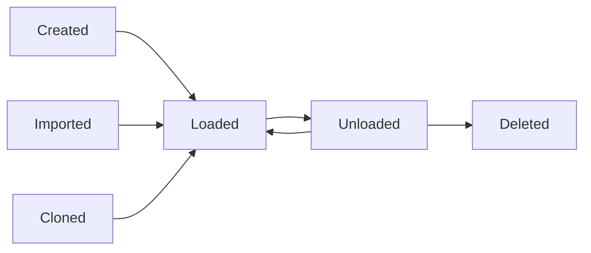

## Overview

LilWorlds provides comprehensive world management capabilities that go beyond basic creation and deletion. This guide covers advanced features, best practices, and optimization techniques.

## World Lifecycle Management

### World States

Understanding world states is crucial for effective management:

<CardGroup cols={2}>
  <Card title="Loaded" icon="circle-check">
    **Active in Memory**
    
    Players can join, chunks are loaded, events are processed
  </Card>
  <Card title="Unloaded" icon="circle-pause">
    **Stored on Disk**
    
    Files exist but world is not in memory, saves resources
  </Card>
  <Card title="Configured" icon="gear">
    **In Configuration**
    
    World settings stored in worlds.yml, can be loaded
  </Card>
  <Card title="Orphaned" icon="circle-exclamation">
    **Files Only**
    
    World folder exists but not in configuration
  </Card>
</CardGroup>

### State Transitions



## Advanced World Creation

### Creation Options

LilWorlds supports extensive customization during world creation:

```bash
# Basic creation
/world create myworld

# With environment
/world create nether_world NETHER

# With custom generator
/world create void_world NORMAL -g VoidGenerator

# With seed
/world create seeded_world NORMAL -s 12345

# Combined options
/world create custom_world NORMAL -g MyGenerator -s 67890 --structures false
```

### Batch World Creation

For servers requiring multiple worlds:

<Steps>
  <Step title="Prepare Configuration">
    Create a batch configuration file with world definitions
  </Step>
  <Step title="Use Scripting">
    ```bash
    # Example batch creation script
    /world create survival NORMAL
    /world create survival_nether NETHER
    /world create survival_the_end THE_END
    /world create creative NORMAL -g FlatGrass
    /world create minigames NORMAL -g VoidGenerator
    ```
  </Step>
  <Step title="Configure Groups">
    Set up inventory groups and permissions
  </Step>
</Steps>

### Async World Creation

LilWorlds creates worlds asynchronously to prevent server lag:

```yaml
# config.yml
performance:
  async-world-creation: true
  max-concurrent-world-operations: 3
```

<Info>
**Performance Tip:** Async creation prevents server freezing during world generation, especially for large worlds.
</Info>

## World Loading and Unloading

### Smart Loading

LilWorlds provides intelligent world loading:

```bash
# Load specific world
/world load myworld

# Load all configured worlds
/world load

# Load with specific settings
/world load myworld --force
```

### Automatic Loading

Configure automatic loading behavior:

```yaml
# config.yml
settings:
  auto-load-worlds: true
  
  # Load worlds on demand when players try to join
  load-on-demand: true
  
  # Unload empty worlds after delay
  auto-unload-empty: true
  auto-unload-delay: 300  # 5 minutes
```

### Memory Management

Optimize memory usage with strategic unloading:

```bash
# Unload specific world
/world unload myworld

# Unload all empty worlds
/world unload --empty

# Unload with player evacuation
/world unload myworld --evacuate
```

## World Information and Monitoring

### Detailed World Information

Get comprehensive world data:

```bash
/world info myworld
```

<Accordion title="Example Output">
```
=== World Information: myworld ===
Environment: NORMAL
Generator: VoidGenerator
Seed: 1234567890
Difficulty: NORMAL
PvP: Enabled
Players: 3 online
Loaded Chunks: 156
Memory Usage: 45.2 MB
Created: 2024-06-12 14:30:00
Last Accessed: 2024-06-12 22:15:30

Spawn Location: 0, 64, 0
World Border: 29999984 blocks
Game Rules:
  - keepInventory: false
  - doDaylightCycle: true
  - doMobSpawning: true
```
</Accordion>

### World Statistics

Monitor world performance and usage:

```bash
# View world statistics
/world stats myworld

# Server-wide statistics
/worlds stats
```

### Real-time Monitoring

LilWorlds provides real-time monitoring capabilities:

```yaml
# config.yml
monitoring:
  enable-statistics: true
  track-player-time: true
  track-chunk-loading: true
  
  # Performance alerts
  memory-warning-threshold: 80  # Percentage
  chunk-warning-threshold: 1000
```

## World Cloning and Backups

### Advanced Cloning

Create sophisticated world copies:

```bash
# Basic clone
/world clone source target

# Clone with different environment
/world clone overworld nether_copy NETHER

# Clone with modifications
/world clone creative creative_backup --unload-source
```

### Backup Strategies

<AccordionGroup>
  <Accordion title="Manual Backups">
    ```bash
    # Create timestamped backup
    /world clone myworld myworld_backup_$(date +%Y%m%d_%H%M%S)
    
    # Unload backup to save memory
    /world unload myworld_backup_$(date +%Y%m%d_%H%M%S)
    ```
  </Accordion>
  
  <Accordion title="Automated Backups">
    ```yaml
    # config.yml
    backups:
      enabled: true
      interval: 6h  # Every 6 hours
      keep-count: 7  # Keep 7 backups
      worlds:
        - survival
        - creative
    ```
  </Accordion>
  
  <Accordion title="Incremental Backups">
    ```bash
    # Only backup changed regions
    /world backup myworld --incremental
    
    # Full backup
    /world backup myworld --full
    ```
  </Accordion>
</AccordionGroup>

## World Importing

### Import Existing Worlds

Bring external worlds into LilWorlds management:

```bash
# Basic import
/world import existing_world

# Import with specific settings
/world import existing_world NORMAL -g CustomGenerator

# Import and configure
/world import existing_world --configure
```

### Bulk Import

Import multiple worlds at once:

```bash
# Import all worlds in server folder
/world import --scan

# Import specific pattern
/world import --pattern "world_*"
```

### Import Validation

LilWorlds validates worlds during import:

<Tip>
**Validation Checks:**
- Level.dat file exists
- World folder structure is valid
- No naming conflicts
- Compatible with current Minecraft version
</Tip>

## World Deletion and Cleanup

### Safe Deletion Process

LilWorlds implements a comprehensive deletion process:

<Steps>
  <Step title="Confirmation Required">
    First command shows warning and requires confirmation
  </Step>
  <Step title="Player Evacuation">
    All players moved to spawn world safely
  </Step>
  <Step title="World Unloading">
    World properly unloaded from memory
  </Step>
  <Step title="File Deletion">
    World files permanently removed from disk
  </Step>
  <Step title="Configuration Cleanup">
    All references purged from configuration files
  </Step>
</Steps>

```bash
# Delete with confirmation
/world remove myworld

# Force delete (admin only)
/world remove myworld --force

# Delete and backup first
/world remove myworld --backup
```

### Cleanup Operations

Maintain a clean world environment:

```bash
# Remove orphaned world files
/worlds cleanup --orphaned

# Remove empty world folders
/worlds cleanup --empty

# Clean configuration entries
/worlds cleanup --config
```

## Performance Optimization

### Memory Management

Optimize world memory usage:

```yaml
# config.yml
performance:
  # Unload empty worlds automatically
  auto-unload-empty: true
  auto-unload-delay: 300
  
  # Limit concurrent operations
  max-concurrent-world-operations: 2
  
  # Chunk loading optimization
  chunk-loading-optimization: true
  preload-spawn-chunks: false
```

### Resource Monitoring

Monitor resource usage:

```bash
# Check memory usage
/worlds memory

# View chunk statistics
/worlds chunks

# Performance report
/worlds performance
```

### Optimization Recommendations

<AccordionGroup>
  <Accordion title="Memory Optimization">
    - Unload unused worlds regularly
    - Use void generators for creative worlds
    - Limit spawn chunk preloading
    - Configure appropriate view distances
  </Accordion>
  
  <Accordion title="Disk Optimization">
    - Regular cleanup of orphaned files
    - Compress old backup worlds
    - Use efficient world generators
    - Monitor disk space usage
  </Accordion>
  
  <Accordion title="Network Optimization">
    - Limit concurrent world operations
    - Use async operations where possible
    - Optimize chunk loading patterns
    - Monitor player distribution
  </Accordion>
</AccordionGroup>

## World Groups and Organization

### Logical Grouping

Organize worlds by purpose:

```yaml
# config.yml
world-groups:
  survival:
    worlds: [survival, survival_nether, survival_the_end]
    shared-inventory: true
    shared-enderchest: true
    
  creative:
    worlds: [creative, build_world]
    shared-inventory: true
    gamemode: CREATIVE
    
  minigames:
    worlds: [pvp_arena, parkour, spleef]
    shared-inventory: false
    reset-on-join: true
```

### Group Management

```bash
# Manage world groups
/worlds group create survival
/worlds group add survival world_nether
/worlds group remove survival old_world
/worlds group list
```

## Advanced Features

### World Linking

Create connections between worlds:

```yaml
# worlds.yml
world_portals:
  survival_to_nether:
    from: survival
    to: survival_nether
    type: NETHER_PORTAL
    
  hub_to_creative:
    from: hub
    to: creative
    type: COMMAND_BLOCK
    command: "/world tp creative"
```

### Conditional Loading

Load worlds based on conditions:

```yaml
# config.yml
conditional-loading:
  time-based:
    event_world:
      start-time: "18:00"
      end-time: "22:00"
      
  player-based:
    vip_world:
      min-players: 5
      permission: "lilworlds.vip"
```

### World Templates

Create reusable world templates:

```yaml
# templates/survival_template.yml
name: "Survival Template"
environment: NORMAL
generator: null
settings:
  difficulty: NORMAL
  pvp: true
  spawn-animals: true
  spawn-monsters: true
gamerules:
  keepInventory: false
  doDaylightCycle: true
```

## Troubleshooting

### Common Issues

<AccordionGroup>
  <Accordion title="World Won't Load">
    **Symptoms:** World fails to load or appears corrupted
    
    **Solutions:**
    - Check world folder integrity
    - Verify level.dat file exists
    - Check console for error messages
    - Try importing the world again
    - Restore from backup if available
  </Accordion>
  
  <Accordion title="Memory Issues">
    **Symptoms:** Server lag or out of memory errors
    
    **Solutions:**
    - Unload unused worlds
    - Reduce loaded chunk count
    - Enable auto-unload for empty worlds
    - Increase server memory allocation
    - Monitor world memory usage
  </Accordion>
  
  <Accordion title="Performance Problems">
    **Symptoms:** Slow world operations or server lag
    
    **Solutions:**
    - Enable async operations
    - Limit concurrent world operations
    - Optimize world generators
    - Use efficient backup strategies
    - Monitor resource usage
  </Accordion>
</AccordionGroup>

### Diagnostic Commands

```bash
# Diagnose world issues
/worlds diagnose myworld

# Check system health
/worlds health

# Performance analysis
/worlds analyze --performance
```

## Best Practices

### Naming Conventions

Use consistent naming for better organization:

```
# Good naming examples
survival_overworld
survival_nether
survival_the_end
creative_main
creative_staff
minigame_pvp
minigame_parkour
event_2024_summer
backup_survival_20240612
```

### Resource Management

<Tip>
**Resource Management Tips:**
- Regularly monitor memory usage
- Unload worlds during low-traffic periods
- Use efficient generators for large worlds
- Implement automated cleanup routines
- Plan world distribution across server resources
</Tip>

### Security Considerations

```yaml
# Secure world management
security:
  restrict-world-access: true
  log-world-operations: true
  require-confirmation-for-deletion: true
  backup-before-major-operations: true
```

## Next Steps

<CardGroup cols={2}>
  <Card
    title="World Deletion"
    icon="trash"
    href="/lilworlds/world-deletion"
  >
    Learn about safe world deletion with configuration purging
  </Card>
  <Card
    title="Custom Generators"
    icon="wand-magic-sparkles"
    href="/lilworlds/custom-generators"
  >
    Create custom world generators for unique experiences
  </Card>
  <Card
    title="Security Features"
    icon="shield"
  >
    Understand rate limiting and security measures
  </Card>
  <Card
    title="Performance Guide"
    icon="gauge-high"
  >
    Optimize LilWorlds for maximum performance
  </Card>
</CardGroup>